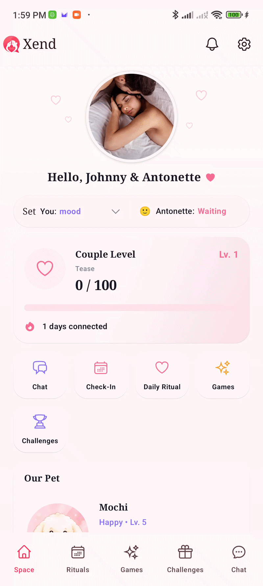

# Xend Mobile

Xend is a private couple space for staying emotionally connected. The app brings mood sharing, secure chat, daily check-ins, rituals, challenges, and relationship progress into one shared mobile experience.



Watch the full demo: [docs/demo.mp4](docs/demo.mp4)

## What It Does

Xend is built around a shared space for two people. Each couple can see their current mood, chat privately, complete daily rituals, check in together, send challenges, and manage their relationship space.

The phase 1 mobile experience focuses on:

- Mood sharing with realtime partner updates
- Private couple chat
- Daily check-in flow
- Daily ritual prompts
- Couple challenges
- Space settings
- User settings and profile surfaces
- Couple image and media-ready UI

Phase 2 features, including games and the shared pet experience, are planned separately.

## Tech Stack

- Kotlin Multiplatform for shared Android and iOS code
- Compose Multiplatform for shared UI
- Android app target with Jetpack Compose runtime integration
- iOS app shell with shared KMP framework
- Ktor Client for REST and websocket networking
- SQLDelight for local persistence
- SQLCipher on Android for encrypted local database storage
- Koin for dependency injection
- Kotlinx Serialization for JSON
- Kotlinx DateTime for cross-platform time handling
- Firebase Cloud Messaging for push notifications
- LibSignal client libraries for secure messaging foundations
- Heroicons Compose Multiplatform icons
- ZXing for QR code and invite scanning support

## Project Structure

- [shared](shared/src) contains shared Kotlin Multiplatform business logic, networking, persistence, and Compose UI.
- [androidApp](androidApp) contains the Android application entry point and Android-specific runtime configuration.
- [iosApp](iosApp) contains the iOS application shell that consumes the shared framework.
- [docs](docs) contains demo media and product notes.

## Backend

The production API is configured for:

```text
https://api.xend.space
```

Android receives this through `BuildConfig.API_BASE_URL`. The shared networking layer uses this base URL for authenticated API calls and realtime sync.

## Running Locally

Build the Android debug app:

```bash
./gradlew :androidApp:assembleDebug
```

Compile Android Kotlin:

```bash
./gradlew :androidApp:compileDebugKotlin
```

Run shared Android host tests:

```bash
./gradlew :shared:testAndroidHostTest
```

Run iOS simulator tests:

```bash
./gradlew :shared:iosSimulatorArm64Test
```

For iOS, open [iosApp](iosApp) in Xcode and run the app from the workspace/project.

## Status

Xend Mobile is in active pre-release development. The current build is focused on the phase 1 couple experience and integration with the live Xend API.
